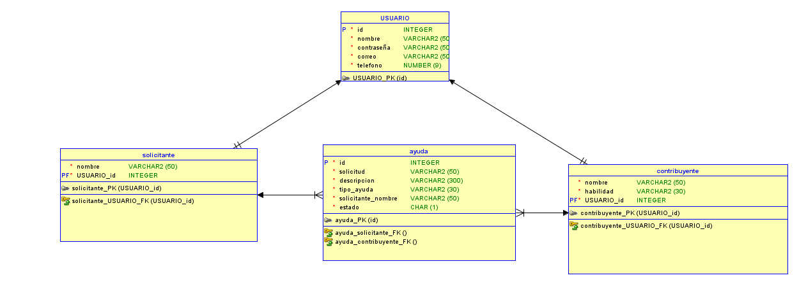

## Guion y funcionamiento del proyecto

Lo primero que se hizo fue desarrollar la base de datos, puesto que sin esta no se puede empezar a desarrollar el programa, puesto que la funcion del programa es poder unir a personas que necesitan ayuda con personas que puedan ofrecersela, pensamos en diseño sencillo con tres entidades.

